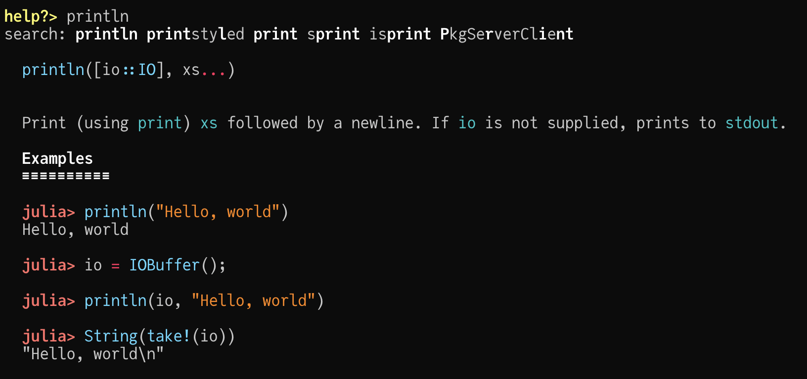
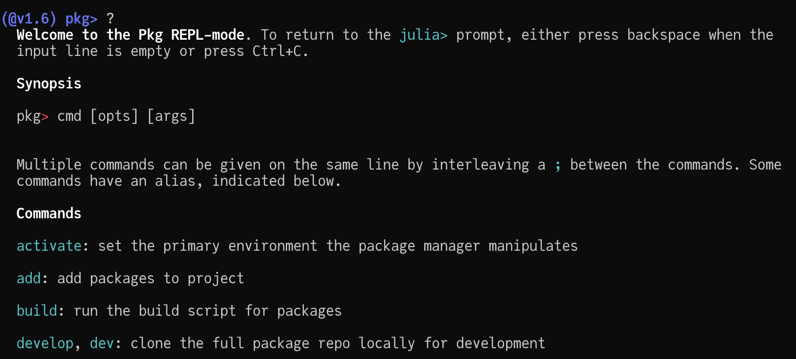
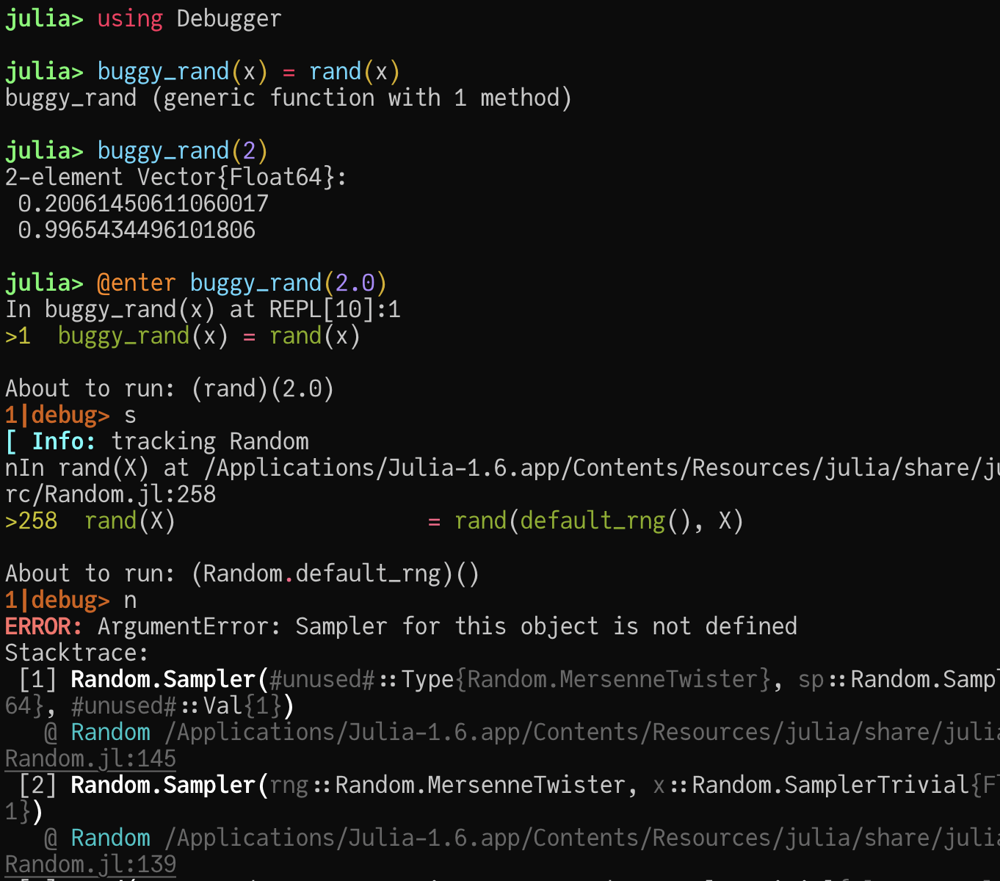

# Julia REPL 下不同的交互模式

这里只是一个非常简略的介绍， 详细的介绍请参考 [The Julia REPL][Julia-REPL].

REPL 的全称是 Read-Eval-Print Loop, 对于科学计算等领域来说， REPL 的这种工作流非常适合概念验证以及建模等需要
频繁交互的模式。

Julia 有几个主要的工作模式：

| 模式 | 说明 | 进入方式 |
| --- | --- | --- |
| Julian 模式 | 执行 Julia 代码的地方 | 默认模式， 在其他模式下可以通过退格键 Backspace 进入 |
| Pkg 模式 | Julia 装包时使用的模式 | 在 Julian 模式下按 `]` 进入 |
| Help 文档模式 | 查询文档时使用 | 在 Julian 模式下按 `?` 进入 |
| Shell 模式 | 切换到系统命令行 | 在 Julian 模式下按 `;` 进入 |
| Debug 模式 ｜ 进入到代码调试模式 | 安装 Debugger.jl 后使用 ｜

## Julian 模式

Julian 模式是执行 Julia 代码的模式。 在某种意义上， Julian 模式可以理解成主要模式： 其他模式都是从 Julian 模式进入的。


对于那些喜欢在 REPL 下敲 Julia 的人来说， [OhMyREPL.jl](https://github.com/KristofferC/OhMyREPL.jl) 是
一个很有用的语法高亮插件。

每天一个小知识：

- "Julian": Julia 的形容词版本， 比如说 "Write codes in the Julian style" 写出具有 Julia 风格的代码。

## Help 文档模式

作为合格的程序员一定要学会阅读文档， Julia 提供了一个非常方便的文档界面。

在 Julian 模式下按 `?` 可以进入到 Help 文档模式， 然后输入需要查询的



关于文档阅读：

- `[]` 所包括的内容是可选的输入。 这是 Linux 世界的一个基本约定， 对于 macOS/Linux 系统， 不妨在命令行中阅读 `man ssh` 的内容。
- `...` 表示该参数的输入数目是可变的。 
  实际上 Julia 函数就是这么定义的， 例如 `f(x...) = sum(x)` 允许不同情况的输入： `f(1)`、 `f(1, 2)` 或其他。

每天一个小知识：

- Julia 支持 Unicode 字符， 因此你会经常看到一些数学符号的出现， 例如 `λ`, `≈`. 在文档中也可以查询到这些符号的输入方式。
- Julia 下一个函数是可以有多个不同文档的， 尝试一下 `?sum((1, 2, 3))` 以及 `?sum([1, 2, 3])` 你会发现出现的内容并不一样。
  这是因为 Julia 的文档查询会根据具体输入值的类型来进行跳转。 在这个例子里 `(1, 2, 3)` 并不是矩阵类型， 因此只适用于矩阵的
  文档不会出现。

## Pkg 模式

在 Julian 模式下按 `]` 进入到 Pkg 模式， 从而可以很方便地进行装包等操作。


在 Pkg 模式下按 `?` 可以得到一些关于 Pkg 模式的帮助



其中最有用的几个命令是：

- 装包: `add Example`
- 删包： `rm Example` 或 `remove Example`
- 更新包版本: `up` 或 `update`
- 查看当前环境: `st` 或 `status`
- 切换环境:
  - `activate` 激活到 root 环境， 即打开 Julia 时的默认环境
  - `activate <folder_path>` 切换到指定目录的环境
  - `activate --temp` 激活一个临时环境
- 执行单元测试:
  - `test` 执行当前环境的单元测试
  - `test <package_name>` 执行指定包的单元测试

环境 (Environment) 是一个很重要的概念， 它能够用来帮助管理我们在 Julia 里装的各种包而不会出现冲突。 例如， 假设包 B
需要最高 v0.12.0 的版本的包 A， 而包 C 需要最低 v1.0.0 版本的包 A， 那么有没有办法在系统中同时安装 B 和 C 这两个包
呢？ 如果 B 和 C 不需要被同时使用的话， 那么我们就可以通过环境来隔离它们. 例如：

```julia
# 在包含 env_a 和 env_b 的路径下打开 Julia

# 切换到 env_a 目录的环境
(@v1.6) pkg> activate env_a
  Activating project at `~/Julia/lectures/2-JuliaBasics/env_a`

(env_a) pkg> st
      Status `~/Julia/lectures/2-JuliaBasics/env_a/Project.toml`
  [7876af07] Example v0.5.3

# 切换到 env_b 目录的环境
(env_a) pkg> activate env_b
  Activating project at `~/Julia/lectures/2-JuliaBasics/env_b`

# 注意 Example 的版本是不同的
(env_b) pkg> st
      Status `~/Julia/lectures/2-JuliaBasics/env_b/Project.toml`
  [7876af07] Example v0.4.1
```

`env_a` 与 `env_b` 的每个路径下面都存在两个文件：

- `Project.toml`: 这个定义了当前环境的一些基本信息。 Julia 的包也是以这种方式维护的， 
  例如 [Images Project.toml](https://github.com/JuliaImages/Images.jl/blob/master/Project.toml) 里面
  就定义了这个包的名称， 作者， 版本， 依赖等重要信息。 这个文件本身是比较容易阅读的， 因此经常也会手动维护这个文件。
- `Manifest.toml`: 这个文件定义了当前环境的完整信息， 这个文件非常的冗长， 因此一般来说不会去手动维护这个文件。

实际上， 根目录的环境`(@v1.6)`也是这样维护的， 可以在 `~/.julia/environments/v1.6` 里面找到这两个文件。

**最佳实践**： 将所有包都装到 root 环境下， 时间久了之后必然会导致一些版本之间产生冲突从而导致一些奇怪的现象发生， 
因此非常建议以项目为单位单独管理 Julia 的包版本。

关于 Pkg 的更多的信息，请参考 [Pkg 文档](https://pkgdocs.julialang.org/v1/)。

## Shell 模式

如果你想要不退出 Julia 就执行一些简单的命令行程序， 例如 `git`, `ls`, `cd` 等， 那么可以在 Julian 模式下按
`;` 进入到命令行模式：


## Debug 模式

Debug 模式是一个大多数人都不会愿意使用， 但遇到问题之后又不得不使用的一个工具, 具体的使用请参考 [Debugger.jl](https://github.com/JuliaDebug/Debugger.jl)



<!-- URLs -->

[Julia-REPL]: https://docs.julialang.org/en/v1/stdlib/REPL/#The-Julia-REPL
